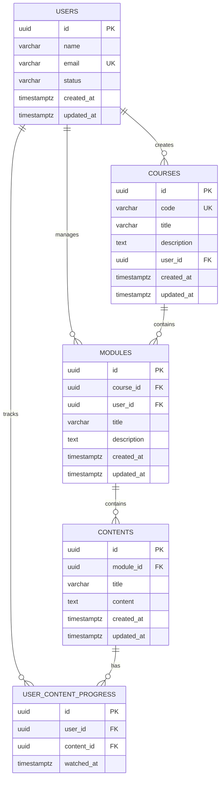

# Entity Relationship Diagram

```mermaid
erDiagram
    USERS ||--o{ COURSES : creates
    USERS ||--o{ MODULES : manages
    COURSES ||--o{ MODULES : contains
    MODULES ||--o{ CONTENTS : contains
    USERS ||--o{ USER_CONTENT_PROGRESS : tracks
    CONTENTS ||--o{ USER_CONTENT_PROGRESS : has

    USERS {
        uuid id PK
        varchar name
        varchar email UK
        varchar status
        timestamptz created_at
        timestamptz updated_at
    }
    COURSES {
        uuid id PK
        varchar code UK
        varchar title
        text description
        uuid user_id FK
        timestamptz created_at
        timestamptz updated_at
    }
    MODULES {
        uuid id PK
        uuid course_id FK
        uuid user_id FK
        varchar title
        text description
        timestamptz created_at
        timestamptz updated_at
    }
    CONTENTS {
        uuid id PK
        uuid module_id FK
        varchar title
        text content
        timestamptz created_at
        timestamptz updated_at
    }
    USER_CONTENT_PROGRESS {
        uuid id PK
        uuid user_id FK
        uuid content_id FK
        timestamptz watched_at
    }
```
